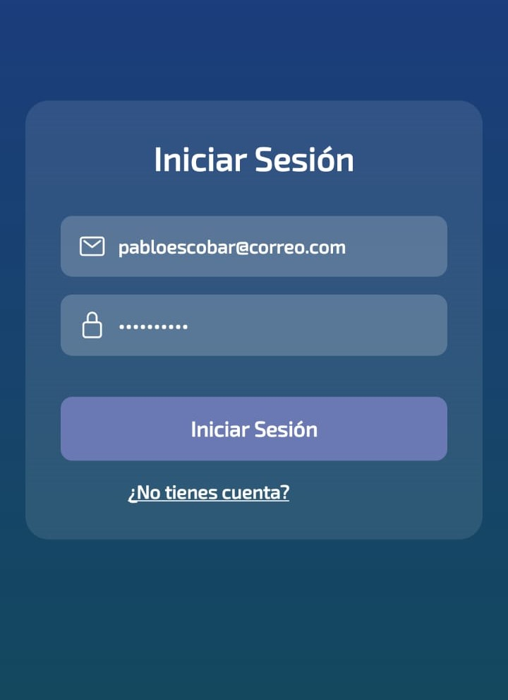
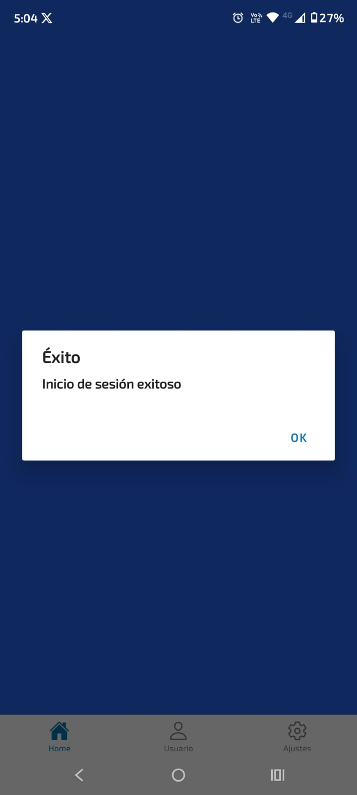
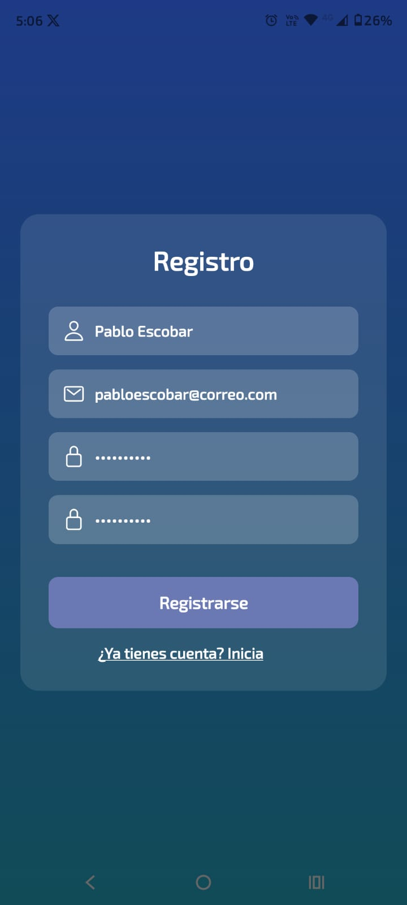
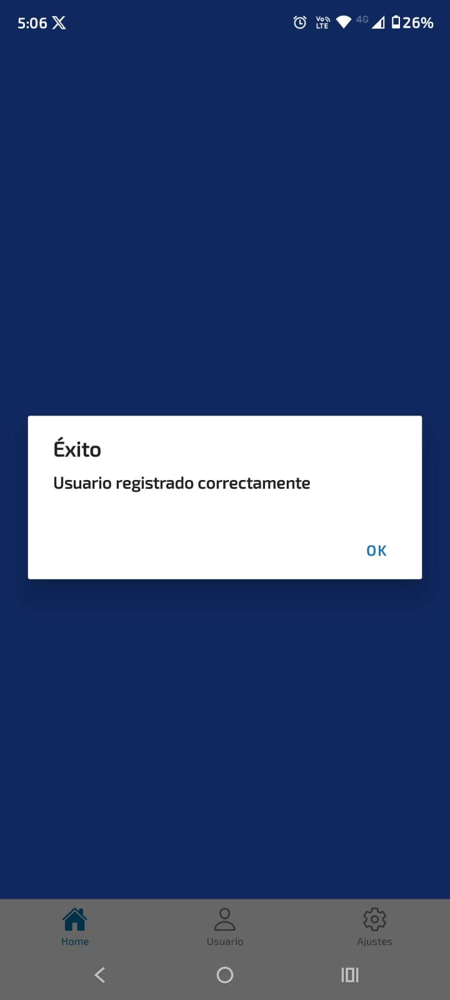
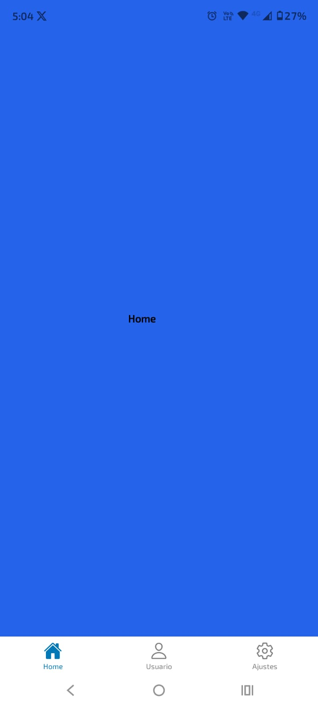
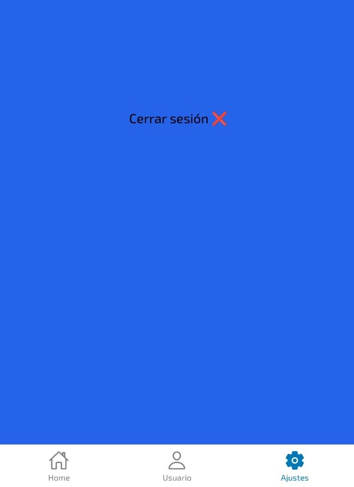
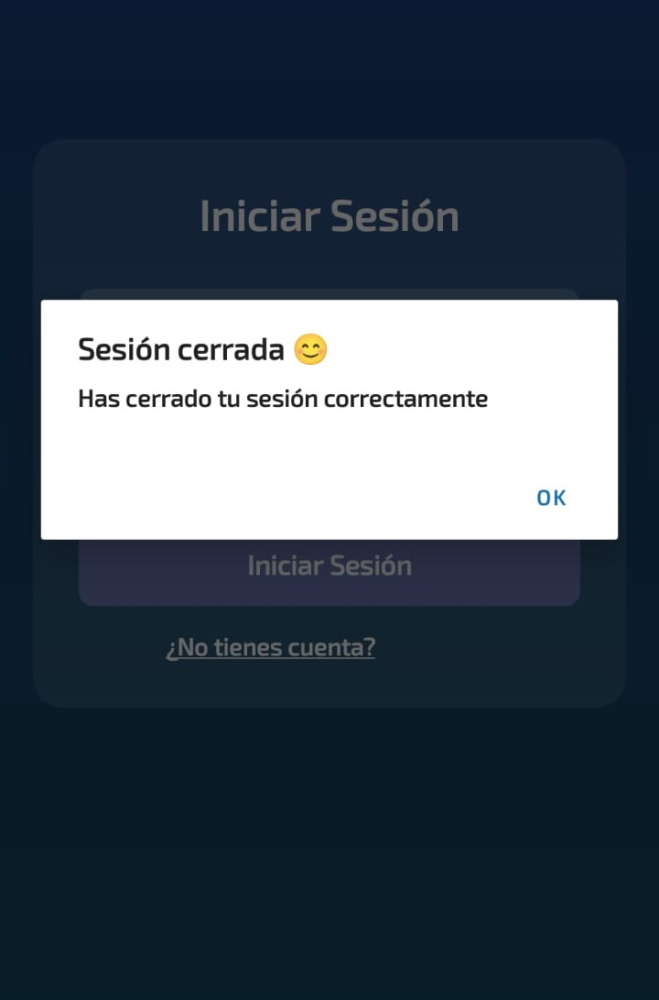

# 🏠 Plataforma de Servicios para el Hogar

## 📌 Descripción

Aplicación móvil desarrollada con React Native (Expo) que permite a los usuarios registrarse, iniciar sesión y acceder a una plataforma orientada a la futura conexión con profesionales de servicios para el hogar como plomería, electricidad y construcción.

---

## 💡 Idea de negocio

La aplicación busca conectar personas que requieren servicios para el hogar con profesionales capacitados, facilitando la contratación de servicios de manera rápida, segura y confiable.

En esta primera versión (Sprint 1), se implementa la base del sistema de autenticación y navegación, sobre la cual se construirán las funcionalidades de conexión entre usuarios y prestadores de servicios.

---

## 🚀 Funcionalidades implementadas (Sprint 1)

* Registro de usuarios
* Inicio de sesión
* Cierre de sesión
* Integración con Firebase Authentication
* Navegación entre pantallas
* Interfaces con estilos personalizados

---

## 📱 Vistas de la aplicación

### 🔐 Login

Permite a los usuarios autenticarse mediante correo electrónico y contraseña utilizando Firebase.

### 📝 Registro

Formulario para la creación de nuevas cuentas de usuario.

### 🏠 Home

Vista principal que se muestra después del inicio de sesión.

### 👤 Usuario

Pantalla donde se visualiza la información del usuario autenticado.

### ⚙️ Ajustes

Incluye opciones de configuración y la funcionalidad de cierre de sesión.

---

## 🛠️ Tecnologías utilizadas

La aplicación fue desarrollada utilizando:

* **React Native con Expo**
* **Firebase Authentication**
* **React Navigation (Stack y Bottom Tabs)**
* **AsyncStorage** (gestión básica de almacenamiento local)

---

## 🔐 Autenticación

Se implementa un sistema de autenticación utilizando Firebase Authentication, que permite:

* Registro de nuevos usuarios
* Inicio de sesión
* Cierre de sesión
* Persistencia básica de la sesión

---

## 📸 Evidencias

La aplicación cuenta con las siguientes funcionalidades visuales:

* Pantalla de inicio de sesión
* Pantalla de registro
* Pantalla principal (Home)
* Cierre de sesión

A continuación, se presentan algunas capturas del funcionamiento de la aplicación:

### 🔐 Inicio de sesión



### 📝 Registro



### 🏠 Home


### 🚪 Cierre de sesión



---

## ⚙️ Instalación y ejecución

1. Clonar el repositorio:

```bash
git clone https://github.com/JhonnyTorres/Proyecto-movil-1
```

2. Instalar dependencias:

```bash
npm install
```

3. Ejecutar la aplicación:

```bash
npx expo start
```

---

## 🔗 Repositorio

👉 https://github.com/JhonnyTorres/Proyecto-movil-1

Nombre del proyecto en desarrollo: Plataforma de Servicios para el Hogar

---

## 📈 Estado del proyecto

🚧 En desarrollo – Sprint 1 completado

---

## 👨‍💻 Autor

Jonathan Torres

---

## 📌 Próximas mejoras

* Implementación de roles (cliente / técnico)
* Conexión entre usuarios y profesionales
* Sistema de solicitud de servicios
* Notificaciones
* Mejora de la interfaz de usuario

---
