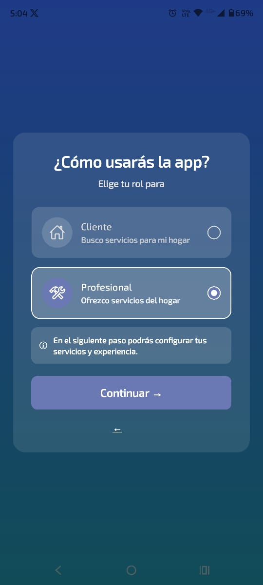

# 🏠 ServiHogar

> Plataforma móvil que conecta clientes con profesionales de servicios del hogar.

---

## 💡 Idea de Negocio

El mercado de servicios del hogar en Colombia carece de una plataforma digital confiable que conecte a clientes con profesionales calificados de manera rápida y transparente. ServiHogar resuelve este problema ofreciendo un **marketplace móvil** donde:

- Los **clientes** pueden buscar y contratar profesionales por categoría de servicio.
- Los **profesionales** pueden ofrecer sus servicios, gestionar solicitudes y construir reputación.
- El **sistema de calificaciones** genera confianza entre ambas partes.
- Las **actualizaciones en tiempo real** mantienen informados a clientes y profesionales en cada etapa del servicio.

### Categorías de servicio disponibles
Plomería · Electricidad · Construcción · Pintura · Carpintería · Cerrajería · Jardinería · Limpieza · Gas · Climatización

---

## 📱 Capturas de Pantalla

| Login | Registro | Selección de Rol |
|:---:|:---:|:---:|
|  |  |  |

| Home Cliente | Buscar Profesionales | Mis Servicios |
|:---:|:---:|:---:|
|  |  |  |

---

## 🛠️ Stack Tecnológico

| Tecnología | Uso |
|---|---|
| React Native + Expo | Framework principal de desarrollo móvil |
| Firebase Auth | Autenticación de usuarios |
| Firestore | Base de datos en tiempo real en la nube |
| SQLite (expo-sqlite) | Persistencia local y modo offline |
| Cloudinary | Almacenamiento de imágenes de perfil |
| React Navigation | Navegación entre pantallas |
| expo-linear-gradient | Gradientes visuales en pantallas de auth |

---

## 🚀 Funcionalidades Implementadas

### Autenticación
- [x] Registro con nombre, correo y contraseña
- [x] Selección de rol (cliente / profesional)
- [x] Perfil profesional con categorías y descripción
- [x] Inicio de sesión
- [x] Cierre de sesión

### Cliente
- [x] Home con métricas y acceso rápido por categoría
- [x] Búsqueda de profesionales por categoría de servicio
- [x] Solicitud de servicio con confirmación
- [x] Historial de servicios con filtros por estado
- [x] Calificación con estrellas y comentario
- [x] Vista de servicios rechazados con mensaje informativo

### Profesional
- [x] Home con resumen de solicitudes y estado del perfil
- [x] Panel de solicitudes en tiempo real
- [x] Aceptar o rechazar solicitudes
- [x] Marcar servicios como finalizados
- [x] Calificación promedio actualizada automáticamente

### Perfil y configuración
- [x] Gestión de foto de perfil con Cloudinary
- [x] Ajustes con cierre de sesión

### Persistencia local (SQLite)
- [x] Caché de servicios del cliente
- [x] Historial de búsquedas recientes por categoría
- [x] Profesionales vistos recientemente

---

## 📁 Estructura del Proyecto

```
servihogar/
├── navigation/
│   ├── AppNavigator.js       # Navegación principal con tabs y stack
│   ├── AuthContext.js        # Contexto de autenticación y rol
│   └── AppProvider.js
├── src/
│   ├── screens/
│   │   ├── auth/
│   │   │   ├── LoginScreen.js
│   │   │   ├── RegisterScreen.js
│   │   │   ├── RoleSelectionScreen.js
│   │   │   └── ProfessionalProfileScreen.js
│   │   ├── HomeScreen.js
│   │   ├── SearchProfessionalsScreen.js
│   │   ├── ClientServicesScreen.js
│   │   ├── ProfessionalServicesScreen.js
│   │   ├── UserScreen.js
│   │   ├── SettingsScreen.js
│   │   └── SplashScreen.js
│   ├── services/
│   │   ├── firebaseService.js
│   │   ├── cloudinaryService.js
│   │   ├── sqliteService.js
│   │   └── userService.js
│   └── constants/
│       └── colors.js
├── docs/
│   ├── ManualTecnico_ServiHogar.docx
│   └── ManualUsuario_ServiHogar.docx
├── App.js
└── README.md
```

---

## ⚙️ Instalación y Configuración

### Requisitos previos
- Node.js 18 o superior
- Expo CLI: `npm install -g expo-cli`
- Cuenta en [Firebase](https://firebase.google.com)
- Cuenta en [Cloudinary](https://cloudinary.com)

### Pasos

```bash
# 1. Clonar el repositorio
git clone https://github.com/JhonnyTorres/Proyecto-movil-1.git
cd servihogar

# 2. Instalar dependencias
npm install

# 3. Iniciar el servidor de desarrollo
npx expo start
```

### Configuración de Firebase

Edita `src/services/firebaseService.js` con tus credenciales de Firebase:

```js
const firebaseConfig = {
  apiKey: "TU_API_KEY",
  authDomain: "TU_PROJECT.firebaseapp.com",
  projectId: "TU_PROJECT_ID",
  storageBucket: "TU_PROJECT.appspot.com",
  messagingSenderId: "TU_SENDER_ID",
  appId: "TU_APP_ID"
};
```

### Índices requeridos en Firestore

| Colección | Campo 1 | Campo 2 |
|---|---|---|
| `servicios` | `clienteId` (Asc) | `creadoEn` (Desc) |
| `servicios` | `profesionalId` (Asc) | `creadoEn` (Desc) |
| `usuarios` | `rol` (Asc) | `servicios` (Arrays) |

---

## 📄 Documentación

- [Manual Técnico](docs/ManualTecnico_ServiHogar.docx)
- [Manual de Usuario](docs/ManualUsuario_ServiHogar.docx)

---

## 👨‍💻 Autor

Desarrollado como proyecto de aula para la materia de **Desarrollo Móvil** — Universidad Católica Luis Amigó.
## 📸 Evidencias

